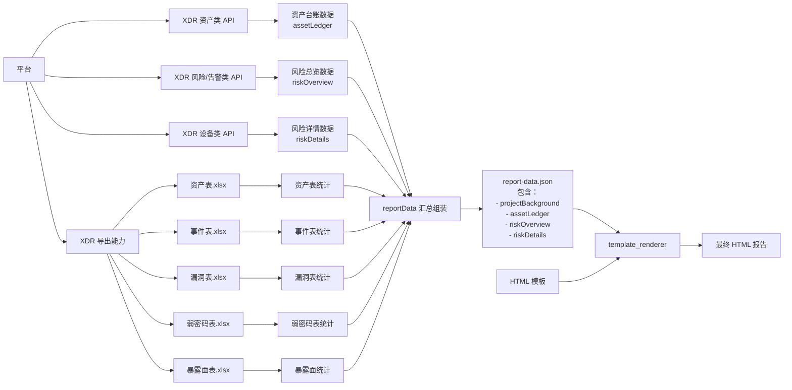

# 安全体检报告取值设计说明

## 1. 背景

安全体检报告是当前的大需求，用户需要通过企微调用 UEM 的 claw 进行报告 HTML/Word 生成操作。本文档设计聚焦数据从平台到 HTML 的过程，还原 claw 背后的行动轨迹。

结合当前代码实现，报告生成的核心目标不是直接在模板里拼接零散数据，而是先沉淀一份统一的结构化数据，再由模板渲染层完成 HTML 输出。这样可以让取值、统计、渲染三部分解耦，后续无论是继续生成 HTML，还是扩展到 Word，都可以复用同一份报告数据。

需要说明的是：当前仓库里的实际落地能力以 HTML 生成为主，Word 生成不在本次代码实现范围内，因此本文档重点描述“平台取值到 reportData，再到 HTML”的主链路。

## 2. 设计目标

本文档希望解决以下几个问题：

1. 让阅读者快速理解报告数据从哪里来、经过哪些处理、最终如何进入模板。
2. 明确各模块职责，避免后续把取值逻辑、统计逻辑、渲染逻辑混在一起。
3. 给后续新增章节或新增指标提供一个统一接入方式。
4. 说明当前实现边界，避免把未实现的 Word 逻辑误认为现状能力。

## 3. 适用范围

本文档仅覆盖当前代码中的报告数据主流程，范围包括：

1. 外部触发参数进入脚本。
2. XDR 相关数据的导出、查询与汇总。
3. Excel 衍生统计的补充计算。
4. 统一报告数据模型 `reportData` 的组装。
5. HTML 模板回填与文件输出。

本文档不展开以下内容：

1. 每一个字段的精确取值口径。
2. 底层接口协议、请求报文和鉴权细节。
3. Word 文件具体生成方式。
4. 模板视觉设计本身。

## 4. 总体方案

当前实现采用“先取值汇总，后统一渲染”的两阶段方案。

第一阶段是数据准备：

1. 接收客户名、时间范围、XDR Cookie 等参数。
2. 根据配置导出 XDR 资产表、事件表。
3. 基于接口和导出表补充统计结果。
4. 将所有结果汇总为统一结构 `reportData`。

第二阶段是内容生成：

1. 将 `reportData` 落盘为 JSON，作为本次报告的中间产物。
2. 用 `reportData` 回填 HTML 模板。
3. 输出最终 HTML 文件路径，供上层系统继续分发或发送。

可以把整个链路理解为：

`企微/UEM发起请求 -> claw脚本执行 -> 平台取值/导表 -> 统计汇总 -> reportData -> HTML模板渲染 -> 输出报告`

## 5. 流程总览

### 5.1 主流程

当前入口脚本是 `health_report.js`。主流程可以概括为以下步骤：

1. 解析命令行参数，确认客户名和报告时间范围。
2. 如果提供了 XDR Cookie，则按配置导出资产表和事件表。
3. 对导出的 Excel 做二次统计，补齐事件闭环、处置状态等衍生指标。
4. 调用数据组装模块，查询平台接口并生成统一 `reportData`。
5. 在已有 `reportData` 基础上，继续补充告警总数、安全日志量、告警消减率、设备分类数等信息。
6. 将最终 `reportData` 写入 `output/report-data.json`。
7. 使用模板渲染器把 `reportData` 回填到 HTML 模板中。
8. 生成最终 HTML 报告并返回产物路径。

### 5.2 简化时序

```text
上游请求
  -> health_report.js
  -> 导出 XDR 表格
  -> 统计 Excel 衍生数据
  -> collectReportData 组装基础报告数据
  -> 补充实时统计数据
  -> 生成 report-data.json
  -> renderReportToFile 渲染 HTML
  -> 输出 HTML 文件
```

### 5.3 数据流转节点图



## 6. 模块职责

### 6.1 入口编排层

入口编排层由 `health_report.js` 负责，主要职责是：

1. 接收和校验运行参数。
2. 决定本次是否执行 XDR 表格导出。
3. 编排数据采集、统计、渲染的调用顺序。
4. 汇总最终输出结果。

这一层不关心模板细节，也不负责具体字段算法，它的核心价值是把各个子模块按固定顺序串起来。

### 6.2 数据组装层

数据组装层由 `src/data_client.js` 负责，主要职责是：

1. 构建报告的基础骨架。
2. 拉取资产台账及风险总览相关数据。
3. 将平台接口结果整理成统一数据结构。
4. 与事件统计结果合并，形成可渲染的数据对象。

这层输出的核心对象是 `reportData`，它是模板渲染的唯一正式输入。

### 6.3 XDR 数据访问层

XDR 数据访问能力主要在 `src/xdr_asset_client.js` 中，职责包括：

1. 读取 Cookie 信息并建立访问上下文。
2. 调用平台接口查询资产、设备、风险、日志、告警等数据。
3. 导出资产表、事件表等外部文件。
4. 将原始接口响应归一化为上层可消费的数据结构。

这一层负责“怎么拿到数据”，不负责模板呈现。

### 6.4 Excel 统计层

Excel 统计层由以下模块负责：

1. `src/incident_excel_stats.js`
2. `src/asset_excel_stats.js`
3. `scripts/incident_status_stats.py`
4. `scripts/asset_table_stats.py`

它的职责是对已导出的表格做补充统计，解决“部分指标更适合从导出明细表再计算”的问题。当前重点用于事件处置状态、闭环情况、涉及资产数等衍生数据。

### 6.5 模板渲染层

模板渲染层由 `src/template_renderer.js` 负责，主要职责是：

1. 读取 HTML 模板文件。
2. 用 `reportData` 替换模板中的占位符。
3. 按约定回填 `data-field`、`data-section`、`data-repeat` 等动态区域。
4. 将完整 `reportData` 注入到页面脚本，供图表或前端脚本继续使用。
5. 产出最终 HTML 文件。

这一层只关心“如何把现成数据放进模板”，不参与业务取值。

## 7. 数据流转设计

### 7.1 输入阶段

报告生成依赖的输入主要有三类：

1. 任务入参：客户名称、开始时间、结束时间。
2. 平台访问凭证：XDR Cookie。
3. 运行配置：模板路径、输出目录、导出表类型等。

这些输入由入口脚本统一接收，并向后传递给导出、查询、统计、渲染等模块。

### 7.2 导表与查询阶段

在当前逻辑中，数据来源不是单一接口，而是“接口查询 + 导出表统计”的组合模式。

其中：

1. 平台接口更适合获取资产总览、设备数量、日志量、告警量等汇总值。
2. 导出 Excel 更适合获取事件明细后的二次统计结果。

因此当前实现不是“所有数据都直接查接口”，而是根据指标特点选择更合适的数据来源，再统一合并。

### 7.3 统一数据模型阶段

所有上游数据最终都会被整理到 `reportData` 中。当前主结构包括：

1. `projectBackground`
2. `assetLedger`
3. `riskOverview`
4. `riskDetails`
5. `appendix`

这样设计的意义是：

1. 模板层只依赖统一对象，不感知底层接口来源。
2. 新增字段时，只要补充到 `reportData`，模板即可直接消费。
3. 后续若扩展 Word，也可以直接复用同一份数据对象。

### 7.4 渲染输出阶段

当 `reportData` 组装完成后，会先写入 JSON 文件，再进入 HTML 渲染阶段。

这么做有两个直接好处：

1. 便于排查问题，看到最终进入模板的数据到底是什么。
2. 便于未来扩展，JSON 可以作为 HTML、Word 或其他输出形态的公共输入。

## 8. 当前代码中的关键处理逻辑

### 8.1 先导出，再统计

如果本次任务提供了 XDR Cookie，脚本会优先导出配置的 XDR 表格。默认导出资产表和事件表。

导出完成后，系统不会直接把 Excel 当作最终报告，而是把它当作中间数据源，再做二次统计。这一步的意义是把原始明细转成报告可读的指标结果。

### 8.2 平台数据与 Excel 统计合并

`collectReportData` 会先构造一份基础报告数据，再拉取 XDR 资产台账与风险总览信息。随后，入口脚本再把事件统计结果和其它补充统计结果合并进来。

因此最终报告数据并不是一次接口调用直接返回，而是多路结果叠加后的产物。

### 8.3 报告 JSON 先落盘

当前实现会显式生成 `report-data.json`。这份文件可以理解为“报告最终数据快照”。

它的作用包括：

1. 作为 HTML 渲染前的标准输入。
2. 作为排障和复盘依据。
3. 作为未来复用到 Word 渲染的候选中间层。

### 8.4 模板按约定回填

模板渲染不是简单的全文替换，而是结合多种方式：

1. 普通占位符替换。
2. `data-field` 字段回填。
3. `data-section` 动态块渲染。
4. `data-repeat` 列表或表格渲染。
5. 页面脚本注入 `window.SECURITY_REPORT_DATA`。

这意味着模板不仅能展示静态文本，也能承载图表、列表、复杂段落等动态内容。

## 9. 输出产物说明

当前流程会产出两类核心文件：

### 9.1 中间产物

`report-data.json`

用途：

1. 保存本次报告统一数据。
2. 支持排障和复核。
3. 为未来多种输出格式提供公共输入。

### 9.2 最终产物

`客户_开始日期_结束日期_安全体检报告.html`

用途：

1. 作为当前可直接交付的报告文件。
2. 供企微或上层流程进行发送、预览或归档。

如果本次启用了 XDR 导表，还会存在资产表、事件表等临时或附属文件，但它们属于数据准备阶段产物，不属于最终对客报告。

## 10. 异常处理与兜底策略

当前实现采用“尽量生成报告”的策略，而不是“任一指标失败就整体终止”。

主要原则如下：

1. 如果某个补充统计失败，则对应字段按空值或 0 兜底。
2. 如果部分接口失败，会记录日志，但只要主流程仍可继续，就继续生成 HTML。
3. 如果缺少 XDR Cookie，则无法进入真实数据模式，主流程不会继续生成真实报告。

这种设计适合当前报告场景，因为报告的首要目标是完成交付；在部分非关键指标异常时，优先保证整体链路可用。

## 11. 边界与约束

### 11.1 当前已实现边界

当前代码明确实现的是：

1. 基于 XDR 数据生成结构化报告数据。
2. 基于统一数据模型生成 HTML 报告。

### 11.2 当前未覆盖边界

当前代码没有真正落地的内容包括：

1. Word 文件渲染与导出。
2. 所有章节的完整字段取值说明。
3. 更细粒度的接口治理能力，例如缓存、重试策略编排、任务化调度等。

因此后续如果要扩展 Word，建议不要重新设计取值流程，而是直接复用当前 `reportData` 作为上游输入。

## 12. 后续扩展建议

基于当前实现，后续扩展建议如下：

1. 新增章节时，优先先补 `reportData` 字段，再补模板，不要在模板脚本里直接写查询逻辑。
2. 新增指标时，优先判断它更适合来自接口还是导出表，保持“取值层”和“渲染层”分离。
3. 如果后续接入 Word，建议让 Word 渲染也直接消费 `reportData.json`，保持 HTML 和 Word 同源。
4. 如果后续要做问题追踪，可以把 `report-data.json` 作为任务执行快照保存下来，便于复盘。

## 13. 总结

按照当前代码逻辑，安全体检报告的取值设计本质上是一个分层的数据流转过程：

1. 入口层负责接收任务并编排执行顺序。
2. 数据层负责从 XDR 接口和导出表中拿到原始数据。
3. 统计层负责把原始数据加工成报告可消费的指标。
4. 组装层负责沉淀统一的 `reportData`。
5. 渲染层负责将 `reportData` 输出为 HTML 报告。

整个设计的核心不是“某个字段怎么取”，而是“所有字段最终都归一到统一数据模型，再由模板消费”。这也是当前实现最适合向阅读者说明的主线。
