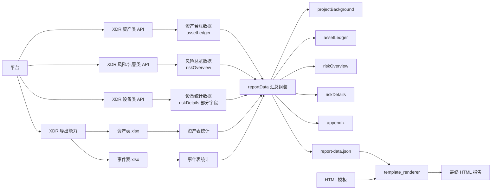

# 数据流转图备份

以下为第一版备份图。

```mermaid
flowchart LR
    A[平台]

    A1[XDR 资产类 API]
    A2[XDR 风险/告警类 API]
    A3[XDR 设备类 API]
    A4[XDR 导出能力]

    B1[资产台账数据<br/>assetLedger]
    B2[风险总览数据<br/>riskOverview]
    B3[设备统计数据<br/>riskDetails 部分字段]
    B4[资产表.xlsx]
    B5[事件表.xlsx]

    C1[资产表统计]
    C2[事件表统计]

    D[reportData 汇总组装]
    D1[projectBackground]
    D2[assetLedger]
    D3[riskOverview]
    D4[riskDetails]
    D5[appendix]

    E[report-data.json]
    F[HTML 模板]
    G[template_renderer]
    H[最终 HTML 报告]

    A --> A1
    A --> A2
    A --> A3
    A --> A4

    A1 --> B1
    A2 --> B2
    A3 --> B3
    A4 --> B4
    A4 --> B5

    B4 --> C1
    B5 --> C2

    B1 --> D
    B2 --> D
    B3 --> D
    C1 --> D
    C2 --> D

    D --> D1
    D --> D2
    D --> D3
    D --> D4
    D --> D5

    D --> E
    E --> G
    F --> G
    G --> H
```
